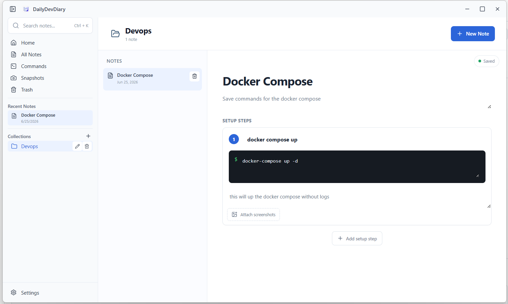

<div align="center">

# DailyDevDiary

### Your local workspace for commands, technical notes, and repeatable solutions.

[](https://tauri.app/)
[](https://react.dev/)
[](https://www.typescriptlang.org/)
[](https://www.rust-lang.org/)

**Fast · Private · Offline-first · No account required**

[](https://github.com/mashood05/DailyDevDiary/releases/latest)

</div>

---

## What is DailyDevDiary?

DailyDevDiary is a lightweight desktop app for keeping the technical knowledge you reuse every day. Save commands, troubleshooting notes, setup guides, explanations, and screenshots in one focused local workspace.

Instead of solving the same problem from scratch, open your diary and pick up exactly where you left off.



## Highlights

| Feature | Description |
| --- | --- |
| 📁 **Collections** | Organize related notes into focused workspaces. |
| ✍️ **Inline editing** | Read and edit on the same page with a Notion-style experience. |
| 🧩 **Setup steps** | Build ordered guides with a title, command, and explanation for every step. |
| 🖼️ **Screenshots** | Attach multiple image references directly to individual setup steps. |
| 📋 **One-click copy** | Browse every command across your notes and copy with a single click. |
| 🗂️ **Focused views** | Home dashboard, All Notes, Commands, and Snapshots collect your work in one place. |
| 🗑️ **Trash** | Soft-delete notes and collections, then restore or permanently remove them. |
| 🎨 **Preferences** | Light, dark, or system theme, default sidebar state, and editor font size. |
| 💾 **Persistent storage** | Everything is saved locally to SQLite and survives restarts. |
| 🖥️ **Desktop-first** | A clean native desktop shell powered by Tauri and Rust. |

## Download

Grab the latest Windows installer from the [**Releases page**](https://github.com/mashood05/DailyDevDiary/releases/latest):

1. Download `DailyDevDiary_0.1.0_x64-setup.exe`.
2. Run it and follow the installer.

> [!NOTE]
> The installer is not code-signed yet, so Windows SmartScreen may show a warning. Click **More info → Run anyway** to continue.

## Build from source

### Prerequisites

- [Node.js](https://nodejs.org/)
- [Rust](https://www.rust-lang.org/tools/install)
- Microsoft Edge WebView2 on Windows

### Run in development

```powershell
git clone https://github.com/mashood05/DailyDevDiary.git
cd DailyDevDiary

cd frontend
npm install

cd ../backend
npm install
npm run dev
```

Keep the terminal open while using the app. Press `Ctrl + C` to stop it.

### Build an installer

```powershell
cd backend
npx tauri build
```

The installer is written to `backend/target/release/bundle/nsis/`.

## Project structure

```text
DailyDevDiary/
├── frontend/              React and TypeScript interface
│   └── src/
│       ├── data/          Storage contracts, in-memory and SQLite repositories
│       ├── features/      Isolated features: home, all-notes, commands,
│       │                  snapshots, trash, settings, and shared pieces
│       ├── hooks/         Application state and autosave behavior
│       └── *.tsx          Title bar, sidebar, workspace, and inline editor
└── backend/               Tauri and Rust desktop application
    ├── capabilities/      Desktop and window permissions
    ├── icons/             Application icons
    └── src/
        ├── features/      Per-feature backend modules
        └── main.rs        Rust entry point
```

## Architecture

The interface depends on a repository contract rather than a specific database implementation.

```text
React interface
      ↓
Application hooks
      ↓
DiaryRepository (contract)
      ↓
SQLite store (default) · In-memory store (fallback)
```

Data is persisted locally with SQLite, so notes, collections, and screenshots
survive restarts. The repository contract keeps the storage layer swappable
without rewriting the editor UI.

## Roadmap

- [x] Desktop application shell with custom title bar
- [x] Collections and notes
- [x] Notion-style inline editor
- [x] Ordered command steps
- [x] Screenshot attachments
- [x] SQLite persistence
- [x] One-click command copying
- [x] Snapshots view
- [x] Trash with restore and permanent delete
- [x] Theme and editor preferences
- [ ] Search, tags, and filters
- [ ] CodeMirror-powered code editing
- [ ] Reusable templates

## Development principles

- Build one small, testable feature at a time.
- Keep frontend and backend responsibilities clear.
- Stay local-first and useful without an internet connection.
- Prefer simple code that is easy to understand and extend.

---

<div align="center">

Built for developers who would rather reuse a solution than rediscover it.

</div>
